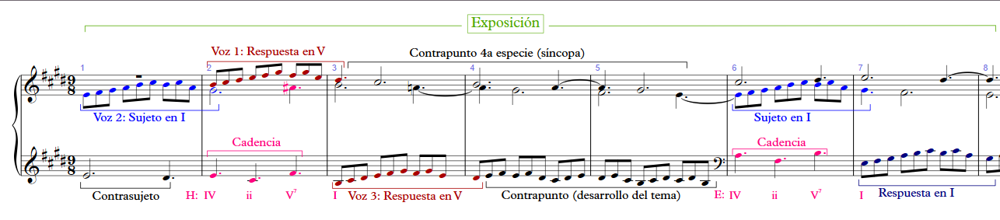
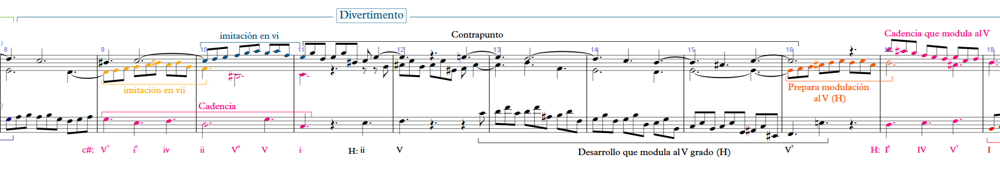
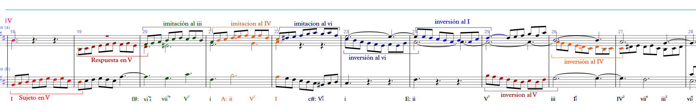
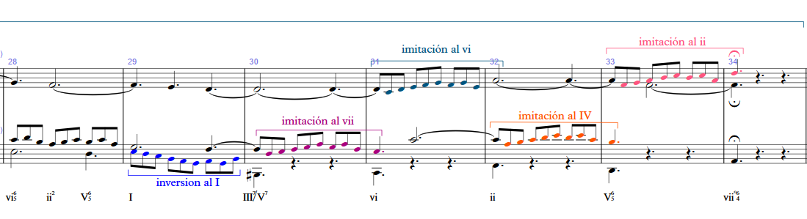
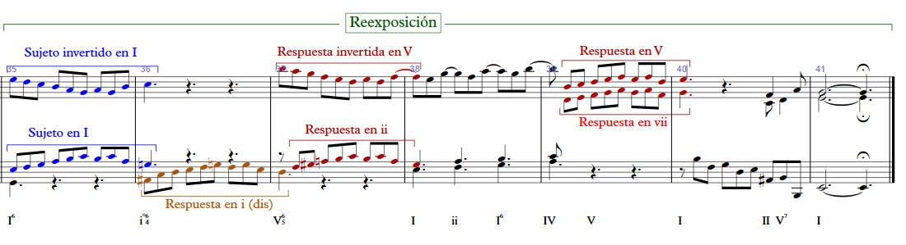

# Análisis de la Sinfonía No. 6 en E, BWV 792, Johann Sebastian Bach 

## Exposición

- Compaces del 1 al primer tiempo del 8.
- El sujeto la inicia la voz de contralto.
- El contrasujeto lo lleva la voz del bajo.
- La respuesta primero la ejecuta la voz de soprano al V grado.
- Después la respuesta la realiza la voz de bajo al V Grado.
- Posterior a la respuesta, el bajo ejecuta un desarrollo utilizando los motivos del sujeto, mientras que las voces de soprano y alto realizan el contrapunto de la 4ta especie, la síncopa.
- El sujeto se vuelve a introducir por la voz de contralto en el grado I.
- La respuesta la realiza el bajo en el grado I.
- Posterior a la respuesta el bajo hace un pequeño desarrollo.s
 
||
|:--:|
||
| Fig. 1 Análisis de la Exposición|

## Divertimento

- Compaces del 8 al 35.

||
|:--:|
||
| Fig. 2 Análisis del Divertimento 1|

||
|:--:|
||
| Fig. 3 Análisis del Divertimento 2|

||
|:--:|
||
| Fig. 4 Análisis del Divertimento 3|

## Reexposición

||
|:--:|
||
| Fig. 5 Análisis de la Reexposición|
