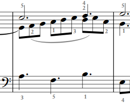

# Día 1: Sinfonía No. 6 en E, BWV 792, Johann Sebastian Bach 

## Objetivo 

Ensayar la exposición de la sinfonía.

||
|:--:|
||
| Fig. 1 Análisis de la Exposición|

## Resumen

Ensayar con la siguiente metodología.
- Analizar partitura.
- Establecer digitación y hacer anotaciones.
- Ensayar con manos separadas.
- Practicar con ambas manos.
- Dividir el trabajo en bloques.

Ejecutar el siguiente plan de trabajo.

- **Bloque 1:** Compases del 1 al primer tiempo del 3. 
- **Bloque 2:** Compases del 3 al primer tiempo del 6.
- **Bloque 3:** Compás 6. *Cadencia*.
- **Bloque 4:** Copmases del 6 al primer tiempo del 9.

Unir bloques.

- Bloques 1 y 2.
- Bloques 2 y 3.
- Bloques 3 y 4.
- Bloques del 1 y al 4.

# Plan de trabajo detallado

## Bloque 1

1. **Mano derecha**: repetir 4 veces el Sujeto la Respuesta. Compases del 1 al primer tiempo del 3. 

    ||
    |:--:|
    ||
    | Fig. 2 Sujeto y respuesta - mano derecha |

2. **Mano izquierda**: repetir 4 veces Contrasujeto. Compases del 1 al primer tiempo del 3. 

    ||
    |:--:|
    ||
    | Fig. 3 Contrasujeto - mano izquierda |

3. Practicar, cuatro veces seguidas[^1], ambas manos los compases del 1 al primer tiempo del 3.
        
[^1]: Cada repetición se cuenta como válida si se ejecuta nítida y precisamente.

## Bloque 2

4. Con la mano izquierda repetir cuatro veces seguidas los compases del 3 al primer tiempo del 6. 

    ||
    |:--:|
    ||
    | Fig. 4 Respuesta voz 3 y desarrollo |

5. Con la mano derecha repetir cuatro veces seguidas los compases del 3 al primer tiempo del 6. 

    ||
    |:--:|
    ||
    | Fig. 5 Contrapunto de la respuesta |

6. Con ambas manos repetir cuatro veces seguidas del compás 3 al primer tiempo del 6.

## Bloque 3

7. **Mano derecha**: ensayar cuatro veces del compás 6 al primer tiempo del compás 7. 

8. **Mano izquierda**: practicar cuatro veces del compás 6 al primer tiempo del compás 7.  

9. Practicar ambas manos, cuatro veces, del compás 6 al primer tiempo del compás 7.

    ||
    |:--:|
    ||
    | Fig. 6 Cadencia |

## Bloque 4

10. **Mano izquierda**: ensayar cuatro veces del compás 7 al primer tiempo del compás 9. 

    ||
    |:--:|
    ||
    | Fig. 7 Sujeto en voz 3 - mano izquierda |

11. **Mano derecha**: ensayar cuatro veces del compás 7 al primer tiempo del compás 9. 

    ||
    |:--:|
    ||
    | Fig. 8 Contrasujeto - mano derecha |

12. Practicar ambas manos, cuatro veces, del compás 7 al primer tiempo del compás 9.

    ||
    |:--:|
    ||
    | Fig. 9 Sujeto en voz 3 |

# :books: Referencias

- [Sinfonía No.6 en E, BWV 792](./pdf/obras/Sinfonia%20No%206%20en%20E%20mayor%20BWV%20792.pdf)

||
|--|
|[:eject_button: Inicio](./dia-01.md)| 

